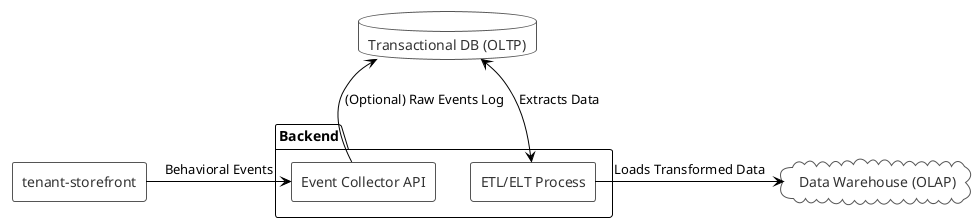

# Data and Analytics Strategy for GXY E-Commerce Platform

## 1. Overview and Goals

This document outlines a comprehensive data strategy for the GXY E-Commerce platform. The primary goal is to leverage data to create actionable insights that drive growth, enhance customer experiences, and empower both platform administrators (`center-control`) and individual tenants (`tenant-backoffice`).

The strategy focuses on:
-   **Centralized Analytics:** Aggregating data for platform-wide insights.
-   **Tenant Empowerment:** Providing tenants with tools to understand their own business.
-   **Personalization:** Enabling data-driven, personalized experiences for end-customers.
-   **Scalability & Performance:** Ensuring that analytics workloads do not impact the performance of the core transactional platform.

## 2. Data Collection

We will collect data from multiple sources to build a 360-degree view of the platform's activity.

-   **Transactional Data:**
    -   **Source:** `backend` (Laravel Application)
    -   **Data Points:** Orders, Customers, Products, Payments, Shipping information.
    -   **Method:** This data is already being captured in the primary OLTP (Online Transaction Processing) database.

-   **Behavioral Data:**
    -   **Source:** `tenant-storefront` (Vue.js Frontend)
    -   **Data Points:** Page views, product impressions, clicks, add-to-cart events, search queries, session duration.
    -   **Method:** Implement a client-side tracking library (e.g., Snowplow Analytics, Mixpanel, or a custom event tracker) to send events to a dedicated collection endpoint on the `backend`.

## 3. Data Architecture

A two-tiered database approach is recommended to separate transactional and analytical workloads.

-   **Transactional Database (OLTP):**
    -   **Technology:** The existing database (e.g., MySQL, PostgreSQL).
    -   **Purpose:** Handles real-time application operations. Optimized for fast reads and writes of individual records.
    -   **Scope:** Contains live production data for all tenants, with strict data isolation enforced at the application level.

-   **Data Warehouse (OLAP):**
    -   **Technology:** A columnar database optimized for analytics (e.g., Google BigQuery, Amazon Redshift, Snowflake, or ClickHouse).
    -   **Purpose:** Consolidates data from various sources for complex querying and business intelligence.
    -   **Scope:** Acts as the central repository for all historical and analytical data. Data from the transactional database will be periodically moved here.

### Data Flow Diagram

## 4. Data Processing (ETL/ELT)

An ETL (Extract, Transform, Load) or ELT (Extract, Load, Transform) process will be responsible for moving and preparing data for analysis.

-   **Extraction:** Data is extracted from the transactional database on a scheduled basis (e.g., nightly).
-   **Transformation:**
    -   **Anonymization:** Personally Identifiable Information (PII) is removed or pseudonymized to protect privacy, especially for cross-tenant analysis.
    -   **Aggregation:** Data is pre-aggregated into summary tables (e.g., daily sales per tenant).
    -   **Enrichment:** Data is combined with other sources (e.g., joining user sessions with purchase data).
-   **Loading:** The processed data is loaded into the Data Warehouse.

-   **Proposed Tools:**
    -   **Workflow Orchestration:** Apache Airflow
    -   **Transformation:** dbt (data build tool) for in-warehouse transformations (preferred for ELT).
    -   **Execution:** Can be run using Laravel's built-in scheduler and queue system for simpler tasks.

## 5. Data Governance and Security

-   **Tenant Data Isolation:** In the Data Warehouse, tenant data must remain queryable only by that tenant, unless it is part of a platform-wide, fully anonymized dataset. Row-Level Security (RLS) policies should be implemented.
-   **PII Protection:** All sensitive customer data must be handled in compliance with data protection regulations (like GDPR, CCPA).
-   **Access Control:** Different roles (`center-control` admin, `tenant` user) will have different levels of access to the data in the warehouse.

## 6. Actionable Strategies

The ultimate goal is to use the analyzed data to take concrete actions.

-   **For Tenants (`tenant-backoffice`):**
    -   **BI Dashboards:** Provide dashboards showing sales trends, top-selling products, customer demographics, and marketing campaign performance.
    -   **Customer Segmentation:** Allow tenants to create customer segments (e.g., "High-Value Customers", "Recent Visitors") for targeted marketing.
    -   **Export Tools:** Allow tenants to export their segmented customer lists for use in external email or ad platforms.

-   **For Platform Admins (`center-control`):**
    -   **Platform Health Metrics:** Monitor overall Gross Merchandise Volume (GMV), new tenant growth, and platform-wide conversion rates.
    -   **Trend Analysis:** Identify popular product categories or emerging market trends across the entire platform using anonymized, aggregated data.
    -   **Fraud Detection:** Develop models to identify potentially fraudulent activity.

-   **For End-Customers (`tenant-storefront`):**
    -   **Product Recommendations:** Implement "Customers also bought" and "Trending products" features.
    -   **Personalized Promotions:** Display targeted offers based on a customer's browsing history or purchase behavior.

## 7. Proposed Tech Stack (Example)

-   **Event Collection:** Custom API endpoint in Laravel.
-   **Transactional DB:** PostgreSQL / MySQL.
-   **Data Warehouse:** Google BigQuery or ClickHouse.
-   **ETL/ELT:** Airflow + dbt.
-   **BI & Visualization:** Metabase (open-source) or Google Looker, integrated into the `center-control` and `tenant-backoffice` frontends.

## 8. Implementation Roadmap

This project can be implemented in phases.

-   **Phase 1: Foundation & Collection**
    -   [ ] Set up Data Warehouse.
    -   [ ] Implement behavioral event tracking on `tenant-storefront`.
    -   [ ] Build initial ETL pipeline to copy transactional data to the Data Warehouse.

-   **Phase 2: Tenant Empowerment**
    -   [ ] Build initial BI dashboards for tenants in `tenant-backoffice`.
    -   [ ] Implement basic customer segmentation tools for tenants.

-   **Phase 3: Platform-Level Insights & Personalization**
    -   [ ] Build BI dashboards for `center-control`.
    -   [ ] Implement product recommendation engine on `tenant-storefront`.
    -   [ ] Develop advanced cross-tenant analytics (fully anonymized).
